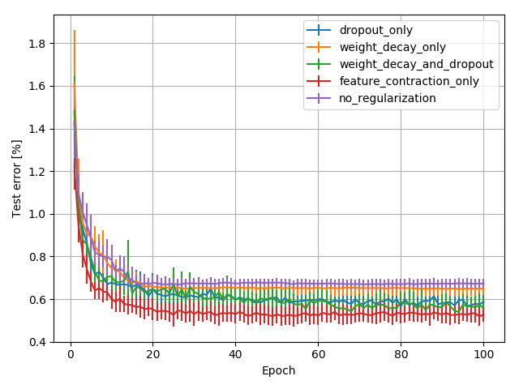

# feature_contraction_on_MNIST_example

### Dependencies:
* python 3.5
* tensorflow-gpu (2.0.0a0)
* tensorflow-datasets (1.0.1)
* matplotlib (3.0.3)

You can run it in a docker container using vlali/tf.v2:0.3 image on dockerhub.
Note that you need to install nvidia-docker in order to use GPUs

### Run instructions:
Change configurations in main.py file

You can set:
* epochs: number of epochs to run for each experiment
* number_runs: number of experiments to run for one configuration
* batch_size: batch size to use
* parallel_processes: how many parallel experiments to run on single GPU

Further experiments can be configured using config_dictionary argument
* weight_decay :                 if not 0 then apply weight decay using this value for the weight decay
* feature_contraction_weight :   if not 0 then use this value for feature contraction
* layer_to_contract :            if not None apply feature contraction after this layer one of "fc3" or "fc4"
* dropout_rate :                 it not 0 apply dropout after fc3 layer

run script main script

When the run is done you should get a curve of mean of test accuracy over epochs with 
error bars shoving the standard deviation. See example below:

